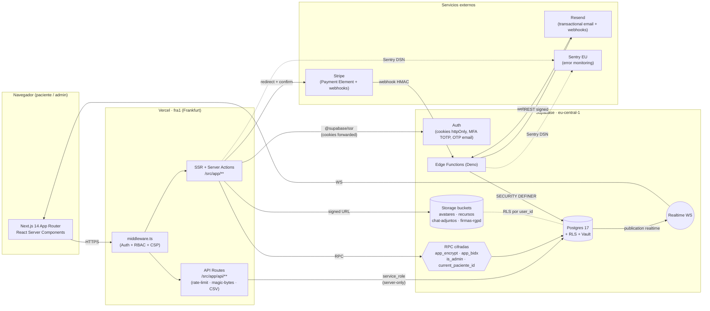
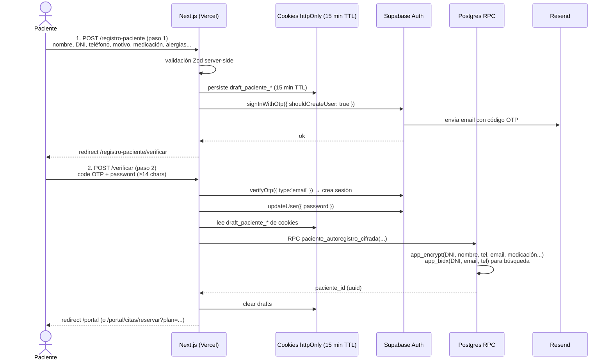
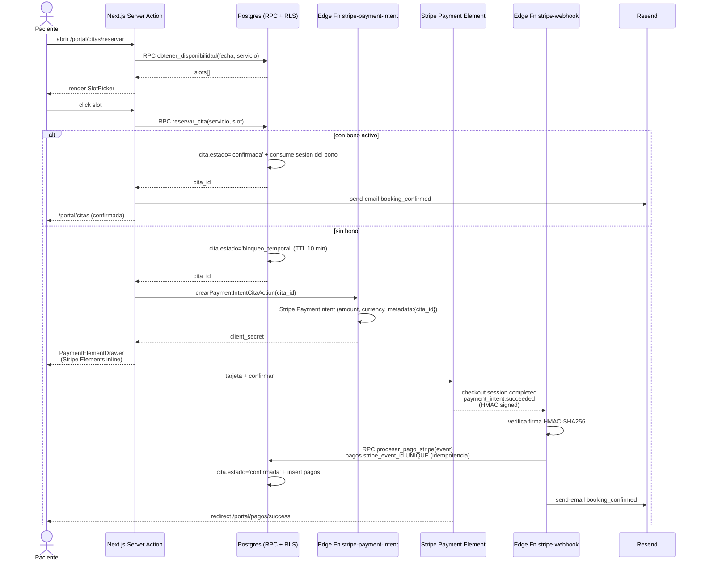
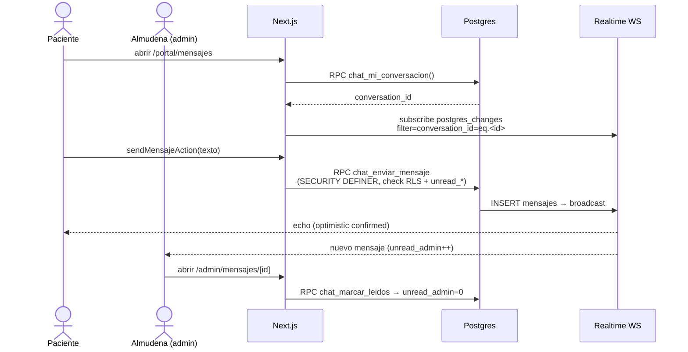
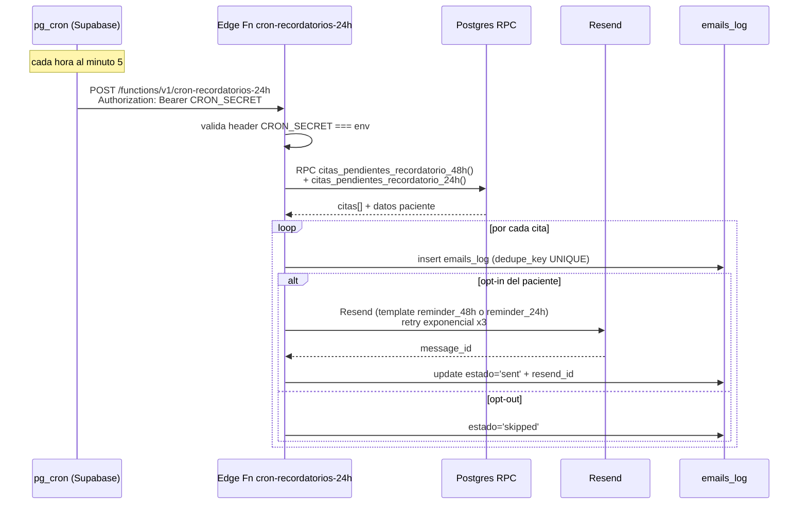
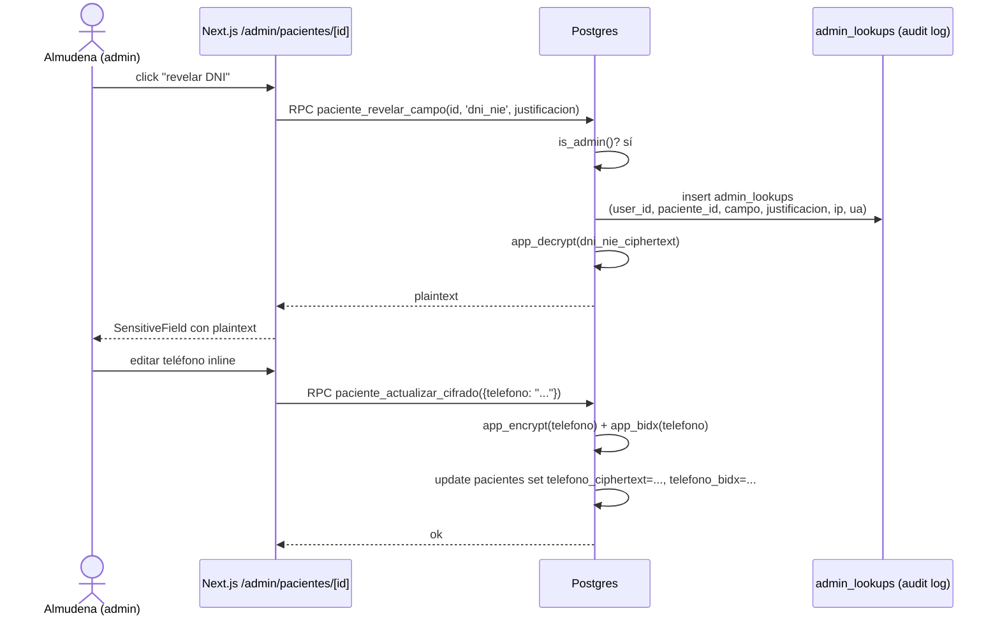
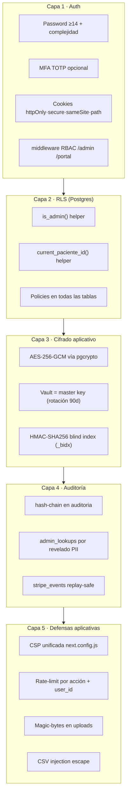

# Arquitectura visual — Clínica Almudena

> Última actualización: **2026-04-22** (hito 14 · limpieza final).
> Documento vivo. Complementa a `arquitectura-tecnica.md` con diagramas Mermaid renderizables en GitHub / VS Code.

---

## 0. Pregunta frecuente: *"¿Dónde está el backend si no hay carpeta `backend/`?"*

**No existe un único servidor "backend" porque no hace falta.** El backend está distribuido en 3 capas, todas gestionadas por Supabase y Vercel — ambas con CI/CD, autoescalado y observabilidad nativas:

| Capa | Dónde corre | Qué hace | Dónde está el código |
|---|---|---|---|
| **BFF / Server Actions** | Vercel (Node runtime) | Validación de inputs, autenticación, orquestación entre frontend y Supabase, subida de ficheros con magic-bytes + rate-limit, exportación CSV. | `frontend/src/services/*`, `frontend/src/app/api/*` |
| **Postgres + RPC + RLS** | Supabase (`eu-central-1`) | Lógica de negocio crítica (reservas, cifrado AES-256 vía pgcrypto+Vault, auditoría, búsqueda blind-index), permisos por fila (RLS). | `supabase/migrations/0001…0029*.sql` |
| **Edge Functions (Deno)** | Supabase Edge Runtime | Webhooks externos firmados (Stripe, Resend), envío de email transaccional, cron horario, generación de PDF de factura, exports RGPD, healthcheck. | `supabase/functions/<name>/index.ts` |

> **Para el que mire el repo**: no verá una carpeta `backend/`, pero sí verá:
> - `supabase/migrations/` → **"ese es tu backend-DB"** (lógica + permisos).
> - `supabase/functions/` → **"ese es tu backend-API externo"** (webhooks + cron).
> - `frontend/src/app/api/` y `frontend/src/services/*` → **"ese es tu backend-for-frontend"**.
>
> Todo documentado en `README.md §1-§2` y en los diagramas de más abajo.

---

## 1. Diagrama de sistema (alto nivel)

---

## 2. Flujo: auto-registro de paciente (hito 14)

---

## 3. Flujo: reserva de cita con pago embebido

---

## 4. Flujo: chat realtime

---

## 5. Flujo: cron recordatorios (ventana ≈48h)

---

## 6. Flujo: admin edita ficha cifrada (con auditoría)

---

## 7. Capas de seguridad (resumen)

---

## 8. Matriz: ¿dónde vive cada responsabilidad?

| Responsabilidad | Vercel (Next.js) | Supabase Postgres | Supabase Edge Fn | Externo |
|---|---|---|---|---|
| Renderizado SSR | **✔** | | | |
| Validación input (Zod) | **✔** | | | |
| Auth (signup/login/MFA) | proxy cookies | **✔ gotrue** | | |
| Reglas de negocio (reservar cita, cifrar PII) | | **✔ RPC+RLS** | | |
| Webhook Stripe (verify firma + idempotencia) | | | **✔ stripe-webhook** | Stripe |
| Webhook Resend (bounce/complaint) | | | **✔ resend-webhook** | Resend |
| Envío email transaccional | | | **✔ send-email** | Resend |
| Cron recordatorios (~48h + ~24h) | | pg_cron trigger | **✔ cron-recordatorios-24h** (migr. **0060+0061**) | |
| PDF facturas | | metadatos | **✔ invoice-pdf** | |
| Export RGPD | | firma | **✔ rgpd-request** | |
| Healthcheck externo | | | **✔ health** (verify_jwt=false) | UptimeRobot |
| Rate-limit upload | **✔ /api/***  | | | |
| Magic-bytes validation | **✔ lib/security/file-validation** | | | |
| CSV injection escape | **✔ /api/admin/facturacion/export** | | | |
| Observabilidad errores | Sentry browser + server | | Sentry Edge | Sentry EU |
| Storage (ficheros) | signed URLs | políticas RLS | | Supabase Storage |
| Pago (PCI) | solo Payment Element | — | — | Stripe |

---

## 9. Migraciones aplicadas en producción

| # | Nombre | Resumen |
|---|---|---|
| 0001-0005 | init · rls · storage · realtime · seed_servicios | Esqueleto base. |
| 0006-0007 | chat · disponibilidad | RPCs de chat y reserva. |
| 0008-0011 | seed demo · email · stripe · audit hashchain | Infra operativa. |
| 0012-0015 | auditoría ficha · chat RGPD prefs · horarios recurrentes · agenda metadata | Compliance + UX clínica. |
| 0016-0020 | ficha MVP · notas cita · recursos · facturas · RGPD exports | Features clínicas. |
| 0021 | security_lints_fix | `security_invoker=true`, `search_path` fijo. |
| 0022-0024b | cifrado F5 | pgcrypto + Vault + RPCs CRUD cifradas + triggers auto-encrypt. |
| 0026 | performance_indexes | 8 índices compuestos + ANALYZE (ganancia 2-10×). |
| 0027 | ficha_bulk_descifrar | lectura atómica multi-campo con audit. |
| 0028 | retirar_seed_demo | script idempotente (pendiente ejecutar al go-live). |
| **0029** | **paciente_autoregistro** | **RPC cifrada para auto-registro OTP (hito 14).** |

---

## 10. Convenciones del equipo

- **Rama de producción GitHub:** `frontend` (minúsculas).
- **Root directory Vercel:** `frontend` (Linux case-sensitive).
- **Región Vercel:** `fra1` (alineada con Supabase `eu-central-1`).
- **Monorepo:** un solo paquete — `frontend/` + `supabase/` + `docs/`. El antiguo `backend/` FastAPI se eliminó en el hito 14 (22-abr-2026).
- **Flujo de migraciones:** append-only. Nunca se reescribe una migración aplicada; se crea una `NNNN+1_fix_*.sql`.
- **Flujo de Edge Functions:** bundle con `node supabase/scripts/bundle_for_deploy.mjs` si se toca `_shared/`, luego `supabase functions deploy <name>`.

---

## 11. Archivos de referencia

- `README.md` — guía global de producción.
- `docs/03_ingenieria/arquitectura-tecnica.md` — visión detallada con invariantes técnicos.
- `docs/03_ingenieria/roadmap.md` — qué queda pendiente post-hito 14.
- `docs/00_proyecto/estado-y-pendientes.md` — estado vivo del proyecto (es la fuente de verdad operativa).
- `supabase/BOOTSTRAP.md` — setup inicial de Supabase desde cero.
